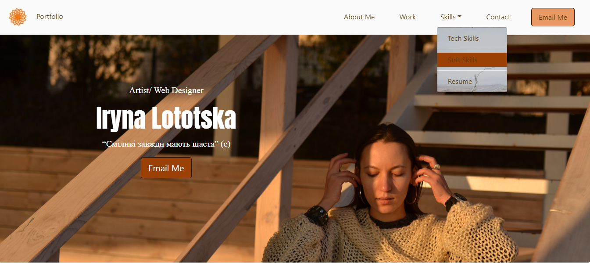
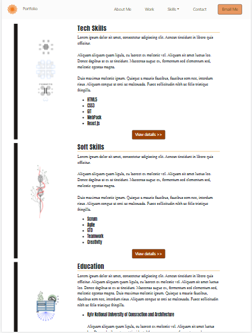
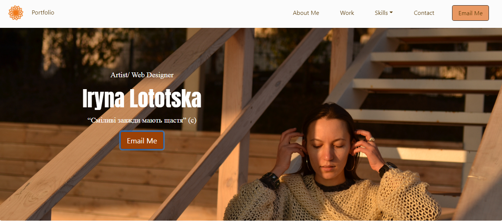
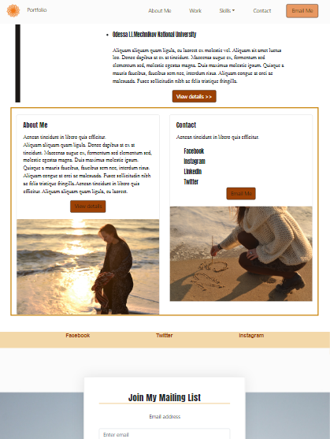
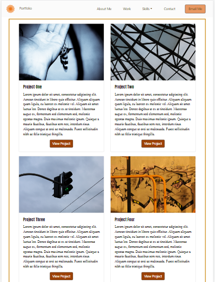
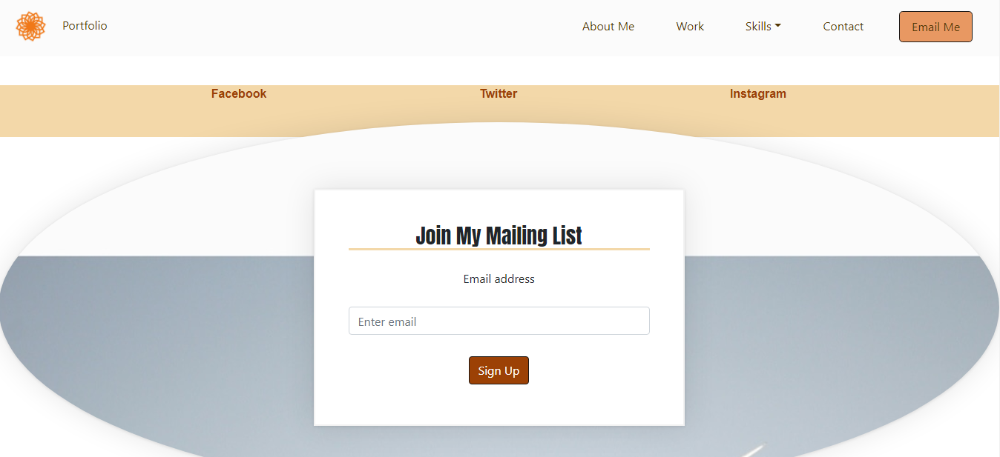

# Bootstrap-portfolio

This is a site created using simplified technology Bootstrap.

## Instructions

1. You can see a navigation menu at the top that leads to each section on the page.

2. Using the dropdown technology, the section "skills" is divided into sections.

 
.
3. It's always easy to write a message, read more and get in touch in another way - using the navigation buttons or links.

 

4. For easier viewing, the section "Work" is divided into columns - the appearance of which will depend on your device: a wider screen - more projects, a narrower - one project.
 

5. Also you can join my mail list -  this way you can use for more actual information. To draw your attention - I used image reshaping and drop shadow.

